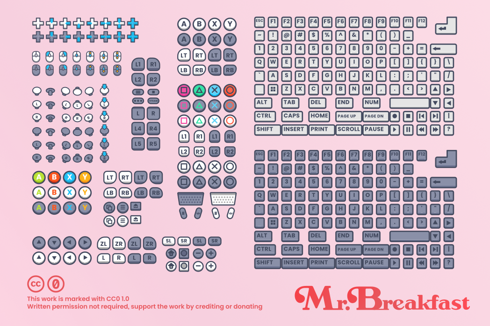
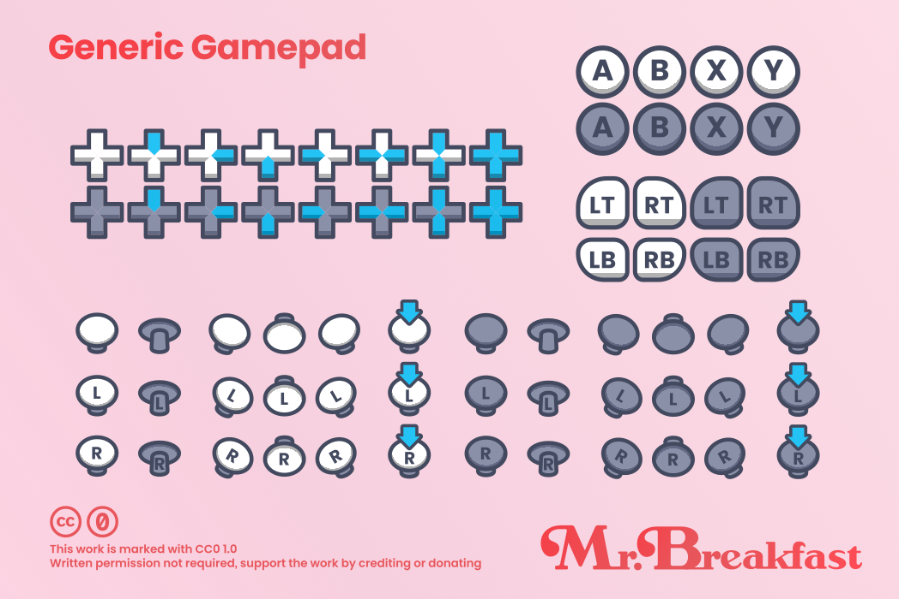
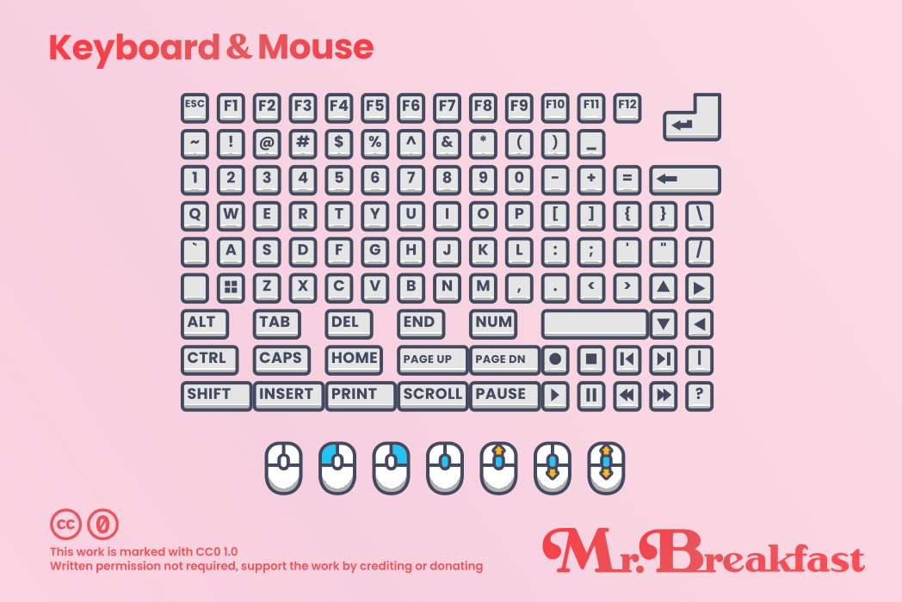
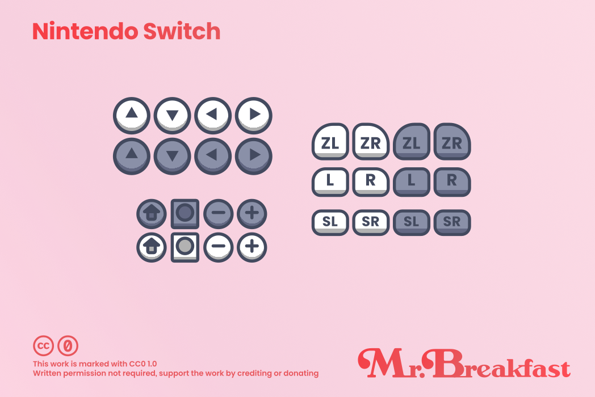
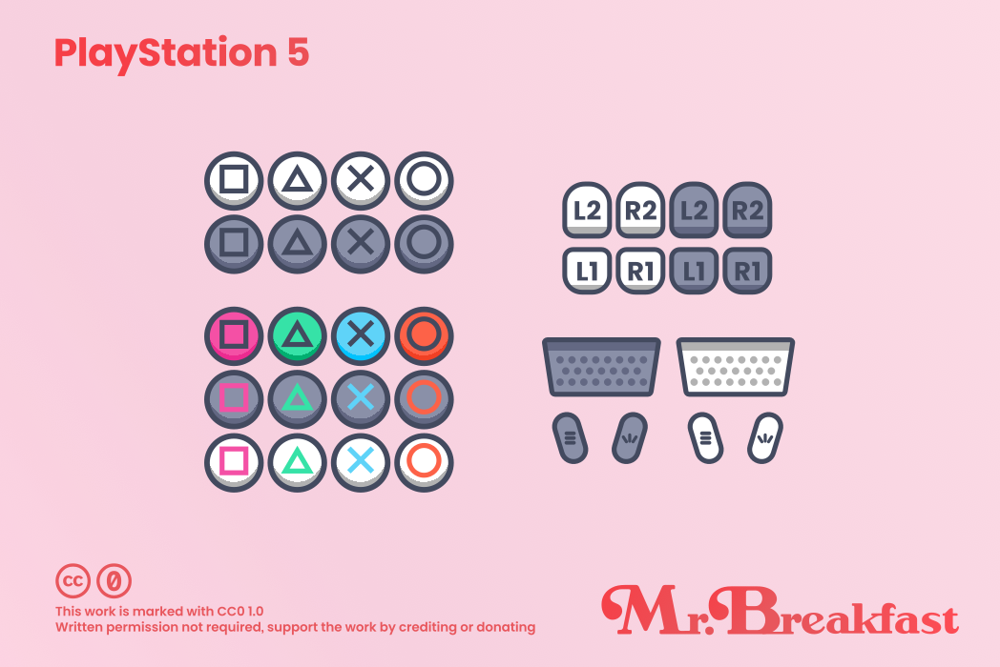
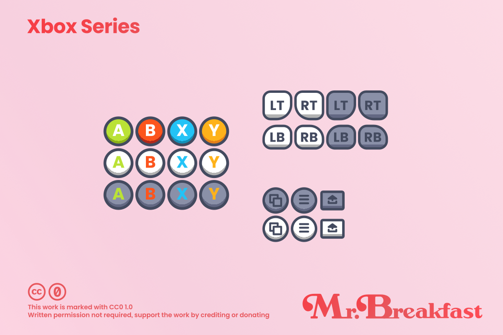
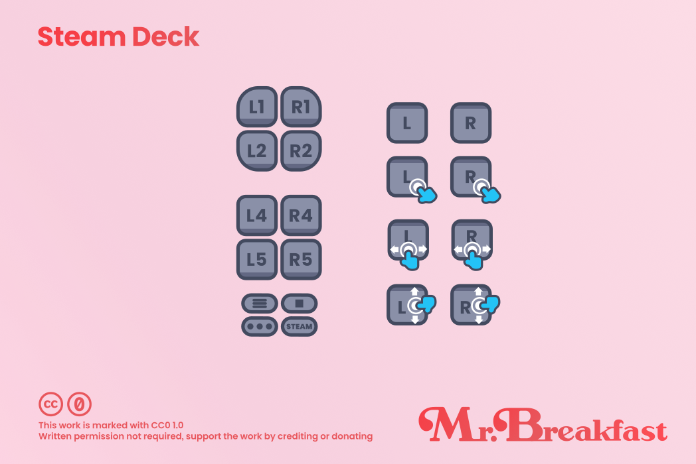

   

 <b>Mr. Breakfast's Free Prompts</b> is an input prompt pack with over 400 svg and png assets 
  
 
  

 

---

  
<b>🍬 Previews</b>

 
   
   
   
   
   
   

---

Inspired by the look and freedom of [Kenney](https://kenney.nl/assets/input-prompts-pixel-16) and the freedom of [Xelu's](https://thoseawesomeguys.com/prompts/) free prompts.

Remix the source here, or download and support the pack on [Itch.io](https://mrbreakfastsdelight.itch.io/mr-breakfasts-free-prompts)

### 🛋️ Supports:
- Nintendo Switch
- Xbox Series
- PlayStation™ 5
- Steam Deck
- Generic game pad
- Keyboard and mouse

### 🖌️ How is the Source made?
The source was designed in [Inkscape](https://inkscape.org/). The assets are created with fill gradients, strokes, and the Poppins font. The gradients are locked and globally shared between assets, allowing for easy edits of the dark and light color schemes.

Here's an example of a generic light button:

And the gradients included so far:

Many of the triggers/bumpers were created using Inkscape's `Corner` live path effect. The keyboard keys have a separate gradient from the buttons for their light and dark schemes.

### ♻️ Contributing Guide

If you intend to submit a pull request, please organize your work under the correct layers, and make sure your paths are properly grouped and named.

Groups begin with the vender name `xbox`, then the name of the button `y`, and then whatever other attributes apply. `color` if it's a colored button, and `dark` or `light` depending on the sceme it follows:

> `vender_title_tags`
> 
> Example: `xbox_y_color_dark`

After you've made your changes, you'll need to update the corresponding files in `~/svg`, `~/png`, svg preview sources in `~/previews/src`, and the exported png previews in `~/previews`.

### 🎂 Who uses these?
So far no one! Want your project featured? Add a link here in the README

